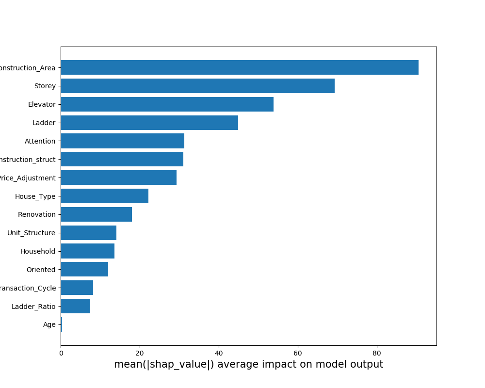

# 模型分析

模型分析模块的功能：对模型预测结果提供可解释。

从以下两个角度出发：

* Shapley：将模型对于样本的预测解释为每个特征对预测结果的贡献值之和，每个特征对预测结果的贡献值可表示为：

  
  $$
  f\left( { X }_{ j } \right) =E\left[ f\left( z \right) |z={ X }_{ i },i=1,2,...,j \right]
  $$
  
* 全局线性替代模型：训练的模型为黑盒模型，难以直接让人理解，使用简单的线性模型来逼近该模型，从而让人理解它的预测结果。
  
  

## Shapley

Shapley模块返回各个特征对各个样本的平均Shapley值，以及各个特征对每一个样本的预测结果贡献图。Shapley值的绝对值越高代表该特征对模型预测结果的影响越大。

关键代码块如下：

```
import shap
import numpy as np
def shapley(model,X):
	'''
	params:
		model:模型
		X:训练该模型的训练集
	return:所有特征对所有样本的平均Shapley值
	'''
  explainer = shap.TreeExplainer(model)
  shap_values = explainer.shap_values(X)
  shap.force_plot(explainer.expected_value, shap_values[0,:], X.iloc[0,:])
  shap_mean=np.mean(abs(shap_values),axis=0)
  return shap_mean
```

结果如下：




## 全局线性替代模型

全局线性替代模型返回各个特征的回归系数，回归系数的绝对值越大，代表该特征对模型预测结果的影响越大。

关键代码块如下：

```
from sklearn import Linear_model
import numpy as np
import pandas as pd
def globalsurrogate(testdata,model,X):
	"""
	params:
		testdata:该模型的测试集
		model：模型
		X：该模型的训练集
	"""
	price=model.predict(testdata)
    coef_list=[]
    data = getData(userData_pred=price[0], X=X)
    X_=data.drop(['Final_Price','Label'],axis=1)
    y=data['Final_Price']
	g=linear_model.LinearRegression(fit_intercept=False)
    g.fit(X_, y)
    coef_list.append(g.coef_)
    return coef_list

def getData():
	"""
	功能：获取与预测结果一档的对应的子数据集
	"""
```

结果如下：


