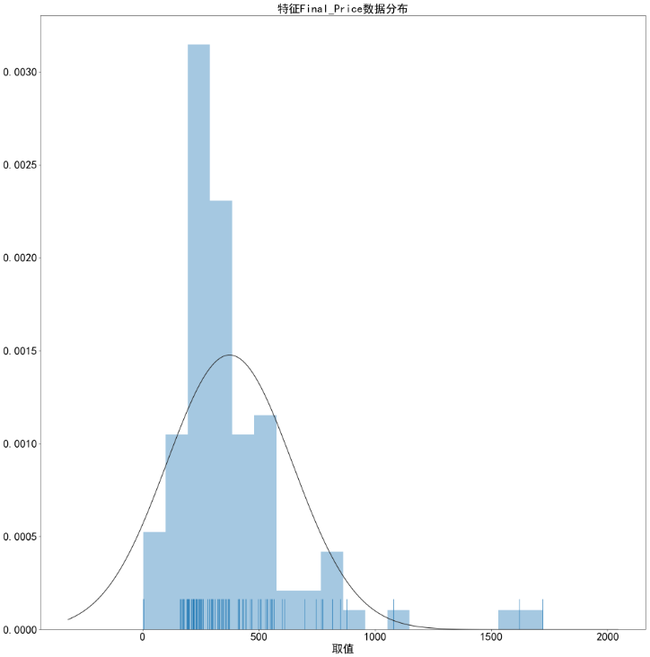

# 人工数据处理

针对数据集的特异性，进行人工的调整。

主要涉及三个方面:

* 特征提取：将特征字段中有意义的部分提取出来
* 特征调整：根据先验知识，将特征进行调整。比如特征组合重构、无意义特征删除等
* 特定处理：根据特定领域进行的处理操作。如房产数据中地理位置转换为经纬度。

## 项目实例

本房产数据的项目实例中，进行了特征调整与特定处理两方面操作。

**特征调整**

- 特征组合：将“区域”、“路段”、“小区名”组合成“地理位置”一个特征。
- 特征删除：将“交易时间”、“ID”等特征删除。

**特定处理**

- 经纬度转换：通过百度地图提供的API接口，将地理位置转换成经纬度数据。核心代码如下：

```python
def Latlng(location):
	url = 'http://api.map.baidu.com/geocoder?address=' + location +'&output=json'
    html = requests.get(url,headers={'Connection':'close'})
    json1 = BeautifulSoup(html.text,'html.parser')
	text = json.loads(json1.text)
    lat = text['result']['location']['lat']
    lng = text['result']['location']['lng']
    return {'lat':lat,'lng':lng}
```


# 数据预处理

对数据进行预处理操作。

主要涉及四个方面:

* 数据概述：对数据的缺失率、唯一值、相关性、数据取值分布进行统计与可视化
* 数据去重：去除重复数据。
* 数据标准化：将数值型数据标准化处理。
* 缺失处理：对存在缺失的数据，利用非缺失的数据实现预测插补

## 项目实例

**数据概述**

- 缺失率统计功能，将统计输入数据各维特征的缺失值情况，并将统计结果输出为柱状图。

  原始数据的缺失值统计将作为本模块中缺失处理部分的重要依据。输出结果仅呈现缺失率高于0.05%的特征，并高亮标注高于缺失率告警阈值的特征。

  核心代码如下：

```python
def plot_missing(data,path,filename,mr_th=0.4):
      rate_series=pd.Series()
      for col in data.columns:
          tempdf=data[col]
          Num_missing=tempdf[tempdf.isnull()].shape[0]
          rate=Num_missing/Num_all
          rate_series[col]=rate
      rate_series=rate_series.rename('缺失率')
      x=data_plt.values*100
      y=data_plt.index
      x_inv=x[::-1]
      y_inv=y[::-1]
      x1=x_inv[x_inv>mr_th*100]
      x2=x_inv[x_inv<=mr_th*100]
      y1=y_inv[x_inv>mr_th*100]
      y2=y_inv[x_inv<=mr_th*100]
      b2=plt.barh(y2[x2>=0.5],x2[x2>=0.5])
      b1=plt.barh(y1[x1>0.5],x1[x1>0.5])
      for rect in b1:
          w=rect.get_width()#获得柱状图的标签取值（即横向宽度，纵向应该获取高度）
          plt.text(w,rect.get_y()+rect.get_height()/2,'%.2f'%(w),ha='left',va='center',fontsize=25)
  	  for rect in b2:
          w=rect.get_width()#获得柱状图的标签取值（即横向宽度，纵向应该获取高度）
          plt.text(w,rect.get_y()+rect.get_height()/2,'%.2f'%(w),ha='left',va='center',fontsize=25)
          plt.xlim([0,110])
      	  plt.yticks(ticks=y_inv[x_inv>=0.5],fontsize=25)
      	  plt.xticks(fontsize=25)
      	  plt.xlabel('缺失率(%)',fontsize=25)
      	  plt.title('缺失率情况统计',fontsize=25)
          if not os.path.exists(path):
          	os.mkdir(path)
      	  plt.tight_layout()
      	  plt.savefig(path+filename+'.png')
```


支持以函数形式进行调用，参数说明如下：

​	data为输入数据，目前支持pd.DataFrame或pd.Series格式的数据

​	path为用以保存缺失率统计图的路径

​	filename为保存缺失率统计图的文件名称（不带后缀名）

​	mr_th为缺失率上限阈值，默认设置为0.4，使用者可根据需要在[0,1]范围内进行调整

基于二手房测试数据得到的缺失率统计情况如下：


- 特征唯一值统计功能，将统计输入数据各维特征的唯一值（unique值）情况，并将统计结果输出为柱状图。

  唯一值统计将作为验证人工处理中数值型/分类型特征划分正确性的重要依据。基于调研与分析，认为输入数据唯一值数量高于一定阈值且变量类型为数值型(numeric)适合作为数值型特征处理，否则应作为分类型特征处理。

```python
def plot_col_unique(data,path,filename):
    rate_series=pd.Series()
    for col in data.columns:
        tempdf=data[col]
        Num_unique=tempdf.unique().shape[0]
        rate_series[col]=Num_unique
    rate_series=rate_series.rename('独立值个数')
    fig=plt.figure(figsize=(30,25))
    data_plt=rate_series.sort_values(ascending=False)
    x=data_plt.values
    y=data_plt.index
    x_inv=x[::-1]
    y_inv=y[::-1]
    b=plt.barh(y_inv,x_inv)
    i=0
    for rect in b:
        w=rect.get_width()
        plt.text(w,rect.get_y()+rect.get_height()/2,'%d'%(w),ha='left',va='center',fontsize=25)
        i+=1
    plt.xlim([0,x.max()*1.1])
    plt.yticks(ticks=y_inv,fontsize=25)
    plt.xticks(fontsize=25)
    plt.xlabel('Unique值个数',fontsize=25)
    plt.title('特征Unique值统计',fontsize=25)
    if not os.path.exists(path):
        os.mkdir(path)
    plt.tight_layout()
    plt.savefig(path+filename+'.png')
```


​	支持以函数形式进行调用，参数说明如下：

​		data为输入数据，目前支持pd.DataFrame或pd.Series格式的数据

​		path为用以保存唯一值统计图的路径

​		filename为保存唯一值统计图的文件名称（不带后缀名）

​	基于二手房测试数据得到的唯一值统计情况如下：


- 特征相关性统计功能，将统计输入数据各维特征之间的互相关情况，并将统计结果输出为热力图。

  特征相关性统计将作为特征选择模块的重要参考。

```python
def plot_correlation(data,path,filename):
   plt.subplots(figsize=(25, 30))
   sns.heatmap(data.corr(), annot=True, vmax=1, square=True,cmap='Blues',annot_kws={'size':15,'weight':'bold', 'color':'black'},fmt=".2f")
   cax = plt.gcf().axes[-1]
   cax.tick_params(labelsize=20)
   plt.xticks(rotation=90,fontsize=25)
   plt.yticks(rotation=0,fontsize=25)
   plt.xlabel('特征名称',fontsize=25)
   plt.title('特征相关度',fontsize=25)
   if not os.path.exists(path):
   os.mkdir(path)
   plt.tight_layout()
   plt.savefig(path+filename+'.png')
```

支持以函数形式进行调用，参数说明如下：

  ​		data为输入数据，目前支持pd.DataFrame或pd.Series格式的数据

  ​		path为用以保存相关性热力图的路径

  ​		filename为保存相关性热力图的文件名称（不带后缀名）

  ​	基于二手房测试数据得到的相关性统计情况如下：

  

- 特征分布统计功能，将统计输入数值型/类别型特征的数据分布，并将统计结果输出为直方图（数值型）/直方图（类别型）。

  特征分布统计可帮助使用者了解数据的取值分布情况。


```python
def plot_numhist(data,path,filename):
  
   
def plot_strbar(data,path,filename):
   
```


​	支持以函数形式进行调用，参数说明如下：

​		data为输入数据，目前支持pd.DataFrame或pd.Series格式的数据

​		path为用以保存相关性热力图的路径

​		filename为保存相关性热力图的文件名称（不带后缀名）

​	基于二手房测试数据，选取具有代表性的数值型特征与类别型特征，统计情况如下:




**数据去重**

- 去除重复数据。核心代码如下：

```python
data.drop_duplicates(keep='first', inplace=True)
data.reset_index(drop=True,inplace=True)
```

**数据标准化**

- 数值变量标准化。

  RobustScaler是sklearn库中的一个线性变换器，对存在异常的数据具有较好鲁棒性。

  核心代码如下：

```python
from sklearn.preprocessing import RobustScaler
data[cols] = pd.DataFrame(RobustScaler().fit_transform(data[cols]),columns=cols)
```
**缺失处理**

* 缺失值的EM预测插补：

  依据未缺失数据的统计均值与方差估计单变量特征的分布。将各维特征视为均值与方差待估计的高斯变量，根据完整数据的均值与方差作为该维特征的统计量估计。对缺失位置填补以该估计量作为参数的高斯随机变量，直至迭代收敛。

  基于EM算法的预测插补具有较高的插值效率，且对数值型变量的插值准确率比较可观。

  对数值型变量，可以直接应用EM算法实现缺失预测插补，核心代码如下：
  
```python
from impyute.imputation.cs import em
em_imp_num = em(NUM_data.values)
em_imp_data1=pd.DataFrame(em_imp_num,columns=NUM_data.columns,index=NUM_data.index)
res[cols['num']]=em_imp_data1
```

  对类别型变量，尤其是包括字符串数据的特征，通过sklearn库的OrdinalEncoder，实现编码、反编码，编码后的特征可通过EM算法实现缺失预测插补，核心代码如下：

```python
def impencode(data,encoder):
  nonulls = np.array(data.dropna())
  impute_reshape = nonulls.reshape(-1,1)
  impute_ordinal = encoder.fit_transform(impute_reshape)
  data.loc[data.notnull()] = np.squeeze(impute_ordinal)
  return data
enc = OrdinalEncoder()
STR_data_placeholder=copy.deepcopy(STR_data)
for col_name in STR_data_placeholder.columns:    	        STR_data_placeholder[col_name].fillna(STR_data_placeholder[col_name].mode()[0],inplace=True
enc.fit(STR_data_placeholder)
enc_col=OrdinalEncoder()
for colname in STR_data.columns:
  impencode(STR_data[colname],enc_col)
  em_imp_str = em(STR_data.astype(float).values)
  em_imp_str = np.round(em_imp_str)
  for y in range(em_imp_str.shape[1]):
   maxlabel=enc.categories_[y].shape[0]-1
   minlabel=0
   for x in range(em_imp_str.shape[0]):
   if em_imp_str[x,y]>maxlabel:em_imp_str[x,y]=maxlabel
   if em_imp_str[x,y]<minlabel:em_imp_str[x,y]=minlabel
  STR_data_imp=enc.inverse_transform(em_imp_str)
  em_imp_data2=pd.DataFrame(STR_data_imp,columns=STR_data.columns,index=STR_data.index)
  res[cols['str']]=em_imp_data2
```

  缺失值处理部分（包括数值型特征缺失处理与分类型特征缺失处理）支持以函数形式调用，参数说明与调用格式如下：

```
def missing_value_processing(data,cols,mr_th)
```

  data为输入数据，目前支持pd.DataFrame或pd.Series格式的数据

  ​	cols为特征标签字典，传入格式为{'num':[数值型特征名1，数值型特证名2,...],'str':[类别型特征名1，类别型特证名2,...]}

  ​	mr_th为缺失率上限阈值，默认设置为0.4，使用者可根据需要在[0,1]范围内进行调整,高于该阈值的特征将被直接丢弃，不进行插值操作