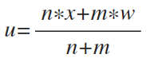

# 特征编码

对数据中分类变量进行特征编码，使字符型数据能被机器学习模型使用。

编码考虑两种方法：


* Onehot-encoding：独热编码，为每个类别创建一个二进制列。
* Target-encoding：按类别平均目标值进行编码。计算公式如下：


>
>
>
>
>- u为目标编码值
>- n为类别中值的个数 
>- x为类别中待编码值对应的平均目标值
>- m为全局平均的权重
>- w为标签的全局平均值


## 项目实例

在项目实例中，两种编码方式均可选择，默认为Target-encoding，减少数据规模并提高可解释性。


- Onehot-encoding
核心代码：
```python
from sklearn.preprocessing import OneHotEncoder
onehot = OneHotEncoder()
onehot.fit(data[cols['str']])
tmp_matrix=onehot.transform(data[cols['str']]).toarray()
data_category = pd.DataFrame(tmp_matrix,columns=onehot.get_feature_names())
```
- Target-encoding 核心代码：
```python
def target_encoding(data, group, target, m):
    # Compute the global mean
    mean = data[target].mean()

    # Compute the number of values and the mean of each group
    agg = data.groupby(group)[target].agg(['count', 'mean'])
    counts = agg['count']
    means = agg['mean']

    # Compute the "smoothed" means
    smooth = (counts * means + m * mean) / (counts + m)

    # Replace each value by the according smoothed mean
    return data[group].map(smooth)
```