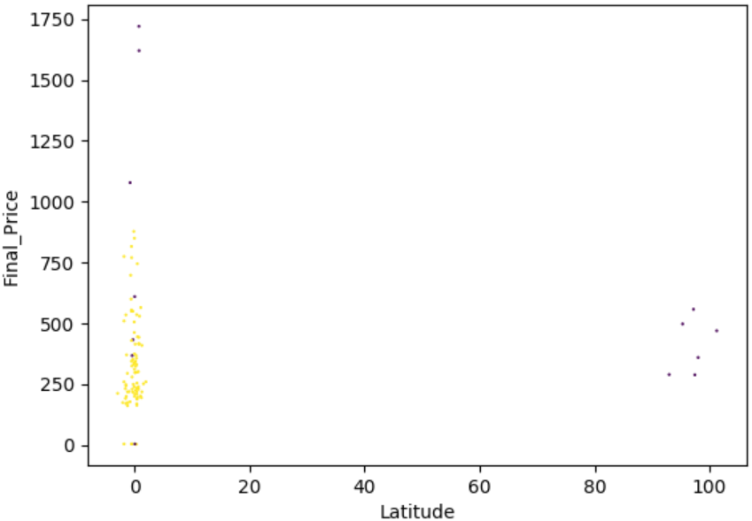

# 异常检测

检测数据集中的异常数据并剔除。

主要使用孤立森林的方法:

> 孤立森林法（Isolation Forest）是一种被广泛采用的集成异常检测算法。孤立森林由一系列孤立
树组成，每一颗孤立树是一个二叉树结构。具体实现步骤如下：
>>	-  从数据集中随机选择一定数量样本作为子空间放入孤立树根节点
>	-  随机选择一个维度，并随机产生切割点将数据在此维度下切分为两个子集。
>	-  递归上一步骤直到子节点只有一个样本点或者孤立树达到指定高度
>	-  循环上述步骤直到生成了指定个数的孤立树
>	-  对于每个数据点，计算其在每棵树的高度并取平均值，得到异常分数
>	-  设定阈值判断数据异常。

## 项目实例

在项目实例中，调用sklearn中的集成模型IsolationForest完成异常检测功能，并使用matplotlib进行画图。

由于一次检测具有偶然性，因此进行多次检测迭代。当检测结果稳定时，终止检测，并剔除异常数据。

核心代码如下：


```python
from sklearn.ensemble import IsolationForest
clf = IsolationForest(behaviour='new', contamination='auto')
pred = clf.fit_predict(data)
data['Outlier'] = pred
tmp = list((set(res) & set(list(data[data['Outlier']==-1].index))))
if len(tmp) == len(res):
    plt_anomaly(data,ylabel,path)
    data.drop(res, inplace=True)
    data.reset_index(drop=True, inplace=True)
    break
else：
	res = tmp
    data.drop('Outlier', axis=1, inplace=True)
```

画图示例如下：




# 特征编码

对数据中分类变量进行特征编码，使字符型数据能被机器学习模型使用。

编码考虑两种方法：
* Onehot-encoding：独热编码，为每个类别创建一个二进制列。
* Target-encoding：按类别平均目标值进行编码。
>
>$$
> u = \frac {n*x+m*w} {n+m}
>$$
> - u为目标编码值
> - n为类别中值的个数 
> - x为类别中待编码值对应目标值的平均
> - m为全局平均的权重
> - w为全局平均值


## 项目实例

在项目实例中，两种编码方式均可选择，默认为Target-encoding，减少数据规模并提高可解释性。
- Onehot-encoding
核心代码如下
```python
from sklearn.preprocessing import OneHotEncoder
onehot = OneHotEncoder()
onehot.fit(data[cols['str']])
tmp_matrix=onehot.transform(data[cols['str']]).toarray()
data_category = pd.DataFrame(tmp_matrix,columns=onehot.get_feature_names())
```
- Target-encoding
```python
def target_encoding(data, group, target, m):
    # Compute the global mean
    mean = data[target].mean()

    # Compute the number of values and the mean of each group
    agg = data.groupby(group)[target].agg(['count', 'mean'])
    counts = agg['count']
    means = agg['mean']

    # Compute the "smoothed" means
    smooth = (counts * means + m * mean) / (counts + m)

    # Replace each value by the according smoothed mean
    return data[group].map(smooth)
```


